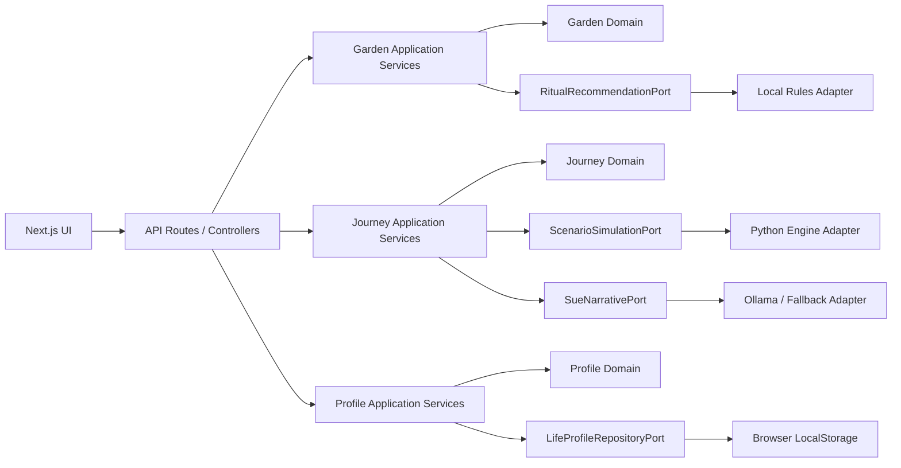
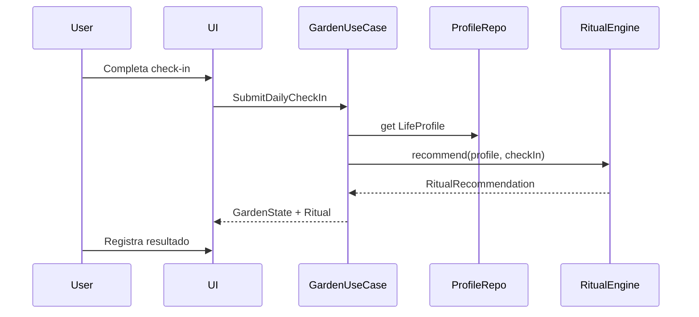
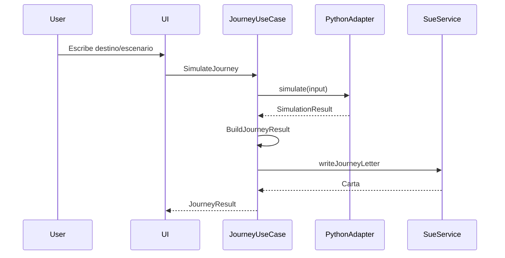

# BRUJULA
# PROP-0001
# Diseno Tecnico v0.8 - Jardin + Viaje

Estado: Propuesta tecnica para desarrollo

Documento base: `PRD-0001_Brujula_v0.8_Jardin_y_Viaje.txt`

## 1. Contexto

La version v0.8 de Brujula separa la experiencia en dos modos:

- Modo Jardin: cultivar bienestar mediante pequenos rituales cotidianos.
- Modo Viaje: calcular la mejor ruta para alcanzar un sueno o meta importante.

Ambos modos utilizan un unico `LifeProfile`.

La UI actual de v0.7 mezcla bienestar, simulacion y planificacion en una sola pantalla. La propuesta de v0.8 busca separar presente y futuro, hacer comprensible cada modo y simplificar la lectura de resultados.

## 2. Analisis del PRD

El PRD plantea un giro correcto de producto: pasar de una pantalla unica de informe/simulacion a dos modos mentales claros.

Modo Jardin responde:

> Que necesita mi vida hoy?

Modo Viaje responde:

> Cual es el mejor camino para llegar a mi sueno?

Esta separacion resuelve el problema principal detectado: la experiencia actual mezcla bienestar, simulacion y planificacion, y los indicadores no explican claramente que hacer despues.

## 3. Alcance MVP recomendado

Para v0.8 se recomienda mantener el alcance acotado:

1. Pantalla inicial con dos opciones: `Cuidar mi Jardin` y `Planificar un Viaje`.
2. Reutilizar el `LifeProfile` actual sin cambiar su formulario.
3. Modo Jardin con check-in local:
   - animo;
   - energia;
   - dolor;
   - sueno;
   - tiempo disponible;
   - necesidad principal;
   - nota opcional.
4. Ritual recomendado deterministico usando `LifeProfile + check-in`.
5. Registro posterior simple: hecho/no hecho y como se sintio la persona.
6. Modo Viaje reutilizando la simulacion actual, pero renombrando y reordenando la presentacion.

## 4. Riesgos de alcance

El riesgo principal es intentar construir tres productos a la vez:

- Jardin;
- Viaje;
- rediseno completo de la experiencia.

El PRD deja correctamente fuera de alcance:

- jardin ilustrado;
- Sue conversacional;
- Health Connect;
- backend;
- animaciones.

La recomendacion es respetar ese limite y construir una base simple pero bien separada.

## 5. Decision sobre roadmap

Existe una pequena tension con el RFC anterior, donde v0.8 sugeria un comparador de caminos. El PRD actual mueve el comparador a v1.1.

La recomendacion es seguir el PRD:

- v0.8: separacion Jardin / Viaje.
- v0.9: rediseno completo del Viaje.
- v1.0: Jardin funcional con historial.
- v1.1: comparador de caminos.

La separacion conceptual es una base de producto mas importante que comparar caminos en esta etapa.

## 6. Objetivo arquitectonico

Evolucionar Brujula hacia una arquitectura basada en:

- Domain-Driven Design;
- arquitectura hexagonal;
- Clean Architecture;
- principios SOLID;
- clean code pragmatico.

La intencion no es sobrediseniar el prototipo, sino separar responsabilidades para que el crecimiento futuro no obligue a reescribir el sistema.

## 7. Bounded Contexts

Se proponen tres contextos principales.

### 7.1 Profile Context

Fuente unica de identidad, salud, finanzas, valores, suenos, preferencias y restricciones.

Responsabilidades:

- mantener `LifeProfile`;
- validar datos minimos;
- exponer senales utiles para Jardin y Viaje;
- preservar compatibilidad con el motor actual.

Casos de uso:

- `CreateOrUpdateLifeProfile`;
- `GetLifeProfile`;
- `DeleteLifeProfile`;
- `SummarizeLifeProfileForDecision`.

### 7.2 Garden Context

Presente cotidiano: check-in, estado del jardin, ritual recomendado y evaluacion posterior.

Entidades y value objects:

- `DailyCheckIn`;
- `GardenState`;
- `Ritual`;
- `RitualRecommendation`;
- `RitualCompletion`;
- `GardenNeed`.

Casos de uso:

- `SubmitDailyCheckIn`;
- `CalculateGardenState`;
- `RecommendRitual`;
- `RecordRitualOutcome`.

### 7.3 Journey Context

Futuro planificado: escenario, restricciones, simulacion, ruta recomendada, riesgo, esfuerzo, hitos y carta de Sue.

Entidades y value objects:

- `JourneyScenario`;
- `JourneyRestriction`;
- `JourneyRoute`;
- `JourneyAssessment`;
- `JourneyMilestone`.

Casos de uso:

- `CreateJourneyScenario`;
- `SimulateJourney`;
- `AssessJourneyRoute`;
- `GenerateSueLetter`;
- `BuildJourneyViewModel`.

## 8. Arquitectura hexagonal propuesta



La UI no debe conocer las reglas internas de rituales ni simulaciones. Solo debe invocar casos de uso y renderizar view models.

## 9. Puertos principales

```ts
interface LifeProfileRepository {
  get(): Promise<LifeProfile | null>;
  save(profile: LifeProfile): Promise<void>;
  delete(): Promise<void>;
}

interface GardenRecommendationEngine {
  recommend(input: {
    profile: LifeProfile;
    checkIn: DailyCheckIn;
  }): Promise<RitualRecommendation>;
}

interface JourneySimulationEngine {
  simulate(input: JourneyInput): Promise<SimulationResult>;
}

interface SueNarrativeService {
  writeJourneyLetter(input: JourneyResult): Promise<string>;
  writeGardenReflection?(input: RitualRecommendation): Promise<string>;
}
```

## 10. Adaptadores iniciales

Para v0.8 se recomiendan adaptadores simples:

- `LocalStorageLifeProfileRepository`;
- `RuleBasedGardenRecommendationEngine`;
- `PythonJourneySimulationEngine`;
- `OllamaSueNarrativeService`;
- `DeterministicSueNarrativeFallback`.

Esto permite preservar el motor Python actual y envolverlo como adaptador de simulacion, sin migrarlo prematuramente.

## 11. Modelos sugeridos

### 11.1 DailyCheckIn

```ts
type DailyCheckIn = {
  mood: number;
  energy: number;
  pain: number;
  sleepQuality: number;
  availableTime: "5m" | "15m" | "30m" | "60m";
  mainNeed: "energia" | "serenidad" | "salud" | "relaciones" | "creatividad";
  note?: string;
  createdAt: string;
};
```

### 11.2 RitualRecommendation

```ts
type RitualRecommendation = {
  ritual: Ritual;
  reason: string;
  expectedEffect: GardenIndicator[];
  intensity: "suave" | "media";
};
```

### 11.3 JourneyInput

```ts
type JourneyInput = {
  destination: string;
  scenarioText: string;
  restrictions: string[];
  lifeProfile: LifeProfile;
};
```

### 11.4 JourneyResult

```ts
type JourneyResult = {
  destination: string;
  recommendedRoute: string;
  successProbability: JourneyProbability;
  estimatedTime: string;
  requiredEffort: "bajo" | "medio" | "alto" | "muy alto";
  mainAdvantage: string;
  mainRisk: string;
  milestones: JourneyMilestone[];
  sueLetter: string;
  rituals: string[];
  advanced: SimulationResult;
};
```

## 12. Reglas iniciales para GardenEngine

Reglas deterministicas recomendadas:

- Si `energy <= 2`, priorizar rituales de baja carga.
- Si `pain >= 6`, evitar rituales fisicos.
- Si `availableTime` es corto, recomendar rituales de 5 a 15 minutos.
- Si `LifeProfile.health.limitsProjects` es alto, bajar intensidad.
- Si el perfil valora creatividad, incluir rituales creativos cuando la energia lo permita.
- Si la necesidad principal es serenidad, priorizar rituales de descanso, respiracion, escritura o orden suave.
- Si la necesidad principal es relaciones, recomendar contacto liviano y no invasivo.

## 13. Principios SOLID aplicados

### Single Responsibility

- `GardenEngine` no simula viajes.
- `JourneyEngine` no decide rituales diarios.
- `LifeProfile` no conoce UI ni almacenamiento.

### Open/Closed

- Nuevos rituales se agregan como reglas o catalogo.
- Futuras integraciones entran como adaptadores.

### Liskov Substitution

- `OllamaSueNarrativeService` y `FallbackSueNarrativeService` deben cumplir el mismo contrato.

### Interface Segregation

Evitar un `BrujulaEngine` gigante. Separar interfaces pequenas:

- `GardenRecommendationEngine`;
- `JourneySimulationEngine`;
- `SueNarrativeService`;
- `LifeProfileRepository`.

### Dependency Inversion

Los casos de uso dependen de interfaces, no de:

- `localStorage`;
- Python;
- Ollama;
- `fetch`;
- componentes React.

## 14. Estructura de carpetas recomendada

### UI

```txt
brujula_engine_v3/ui/
  app/
    page.tsx
    api/
      garden/check-in/route.ts
      garden/ritual/route.ts
      journey/simulate/route.ts
  src/
    profile/
      domain/
      application/
      infrastructure/
      ui/
    garden/
      domain/
      application/
      infrastructure/
      ui/
    journey/
      domain/
      application/
      infrastructure/
      ui/
    shared/
      domain/
      ui/
      infrastructure/
```

### Python

```txt
brujula_engine_v3/brujula_engine/
  profile/
    life_profile.py
  garden/
    check_in.py
    ritual_engine.py
  journey/
    journey_engine.py
    journey_report.py
  simulation/
    existing_engine_files.py
  presentation/
    existing_life_report.py
```

Para v0.8 no es necesario mover todo inmediatamente. Se puede crear la estructura nueva en TypeScript y dejar Python como adaptador estable.

## 15. Flujos principales

### 15.1 Modo Jardin



### 15.2 Modo Viaje



## 16. Diseno de UI recomendado

La pantalla inicial debe representar una decision clara:

```txt
Que quieres hacer hoy?

[ Cuidar mi Jardin ]
Pequenos actos para sentirte mejor hoy.

[ Planificar un Viaje ]
Explora caminos para alcanzar un sueno.
```

### Modo Jardin

Orden recomendado:

1. Check-in.
2. Estado actual con 5 indicadores:
   - energia;
   - serenidad;
   - salud;
   - relaciones;
   - creatividad.
3. Ritual recomendado como accion principal.
4. Registro posterior simple.

### Modo Viaje

Orden recomendado:

1. Destino.
2. Ruta recomendada.
3. Probabilidad.
4. Tiempo estimado.
5. Esfuerzo.
6. Ventaja principal.
7. Riesgo principal.
8. Hitos.
9. Carta de Sue.
10. Detalle avanzado colapsable.

Las graficas pasan a segundo plano.

## 17. Persistencia

Para v0.8:

- `LifeProfile`: `localStorage`, como en v0.7.
- `DailyCheckIn`: estado local o `localStorage` simple.
- `RitualOutcome`: `localStorage` simple.
- Viaje: sin persistencia obligatoria.

No implementar base de datos todavia.

## 18. Estrategia de migracion

1. Crear shell de modos en `page.tsx`.
2. Extraer la pantalla actual a `JourneyMode`.
3. Crear `GardenMode` con estado local y ritual deterministico.
4. Crear tipos compartidos para:
   - `DailyCheckIn`;
   - `GardenState`;
   - `Ritual`;
   - `JourneyResult`.
5. Crear servicios de aplicacion en TypeScript.
6. Mantener `/api/simulate` como adaptador legacy o renombrarlo a `/api/journey/simulate`.
7. Agregar tests unitarios para el motor de rituales.
8. Mantener tests existentes del motor Python para asegurar que v0.7 no se rompa.

## 19. Riesgos tecnicos

- Sobrecargar `page.tsx`.
- Duplicar logica entre TypeScript y Python.
- Convertir `LifeProfile` en un objeto dios.
- Mezclar lenguaje emocional con logica de dominio.
- Crear abstracciones demasiado grandes antes de necesitarlas.

Mitigaciones:

- Extraer componentes y servicios temprano.
- Definir contratos explicitos entre UI y motor.
- Usar view models especificos para Jardin y Viaje.
- Mantener Sue como servicio narrativo/presentacional.
- Crear puertos solo cuando exista un caso de uso real.

## 20. Criterios tecnicos de aceptacion

Modo Jardin:

- El usuario puede registrar un check-in.
- El sistema calcula estado del jardin.
- El sistema recomienda un ritual personalizado.
- El usuario puede registrar si lo hizo y como se sintio.

Modo Viaje:

- El usuario puede crear un escenario.
- El sistema reutiliza `LifeProfile`.
- El resultado muestra ruta, probabilidad, tiempo, esfuerzo, ventaja, riesgo e hitos.
- La lectura principal se comprende en menos de 30 segundos.

Generales:

- Ambos modos usan el mismo `LifeProfile`.
- La diferencia entre Jardin y Viaje es evidente.
- El motor Python actual sigue funcionando.
- Los tests Python existentes siguen pasando.
- El build de Next sigue compilando.

## 21. Resultado esperado

Despues de v0.8, Brujula deberia tener:

- `LifeProfile` como fuente comun;
- `Garden` para bienestar presente;
- `Journey` para planificacion futura;
- UI separada por intencion;
- motor Python preservado;
- nuevos modulos preparados para v0.9, v1.0 y v1.1 sin reescritura mayor.

La recomendacion final es implementar primero la separacion visual y conceptual, luego el `GardenEngine` deterministico minimo. El comparador de caminos queda correctamente postergado para v1.1, cuando `Journey` ya tenga su lenguaje propio.
